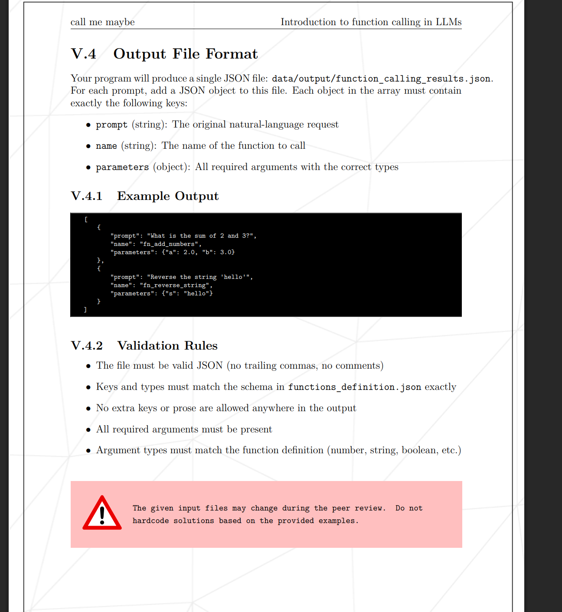

# call-me-maybe

## Output

## Usage
### 1. Как получить ответ через методы SDK (пошаговая генерация)
  Языковая модель генерирует текст по одному токену за раз:
  1. Вы переводите текст промпта в токены (encode).
  2. Запрашиваете у модели логиты для следующего токена (get_logits_from_input_ids).
  3. Выбираете лучший токен (например, «жадный» выбор с наибольшим логитом через argmax).
  4. Добавляете токен к списку и повторяете, пока не встретите токен конца ответа (eos_token_id) или не достигнете лимита длины.
  5. Переводите токены обратно в текст (decode).

  #### Пример:

    import numpy as np
    from llm_sdk import Small_LLM_Model
    
    # Инициализируем модель
    model = Small_LLM_Model()
    
    prompt = "Hello! Tell me who you are in one sentence:"
    
    # 1. Токенизируем входной текст
    prompt_tokens = model.encode(prompt).squeeze(0).tolist()
    tokens = list(prompt_tokens)
    
    max_new_tokens = 50
    eos_token_id = model._tokenizer.eos_token_id
    
    # 2. Цикл авторегрессионной генерации
    for _ in range(max_new_tokens):
        # Получаем логиты для следующего токена
        logits = model.get_logits_from_input_ids(tokens)
        
        # Выбираем токен с максимальным логитом (greedy decoding)
        next_token = int(np.argmax(logits))
        
        # Если модель выдала токен конца генерации — останавливаемся
        if next_token == eos_token_id:
            break
            
        tokens.append(next_token)
    
    # 3. Декодируем только сгенерированные токены (без самого промпта)
    generated_tokens = tokens[len(prompt_tokens):]
    answer = model.decode(generated_tokens)
    
    print(f"Ответ модели: {answer}")