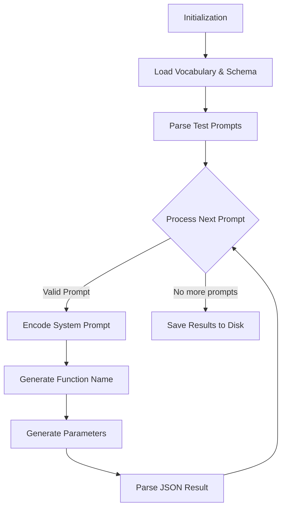
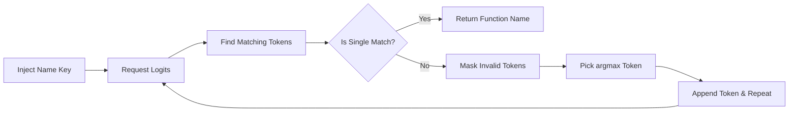
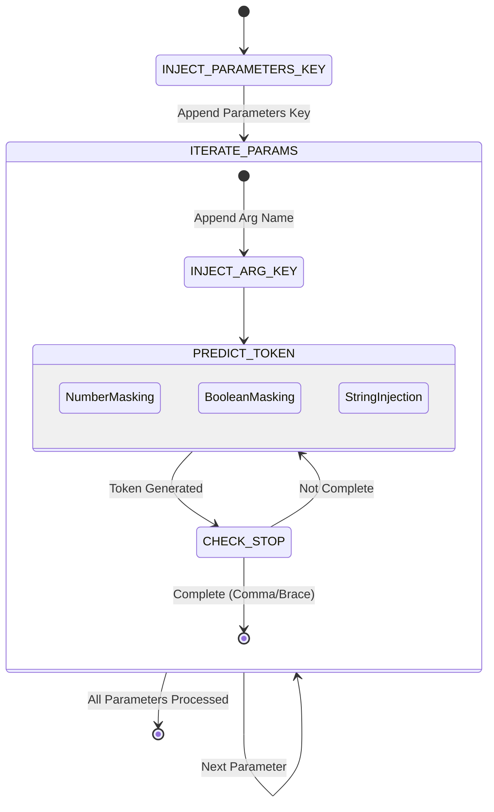

*This project has been created as part of the 42 curriculum by kvolynsk.*

TODO:
- delete agents.md
- delete from makefile extra instructions?
- create test-branch with comprehensive test-cases

# Call Me Maybe ☎️

## Description
"Call Me Maybe" is a lightweight, efficient function-calling engine built on top of small Large Language Models (LLMs). The goal of this project is to implement a highly reliable **Function Calling** that parses user prompts and strictly enforces output schema using constrained decoding. By manipulating logits during generation, we guarantee that the LLM generates valid JSON matching the provided function definitions, preventing hallucinations and formatting errors.

## Instructions
### Installation
The project uses `uv` for lightning-fast package management and dependency resolution.
```bash
# Clone the repository
git clone <your_repo_url>
cd call-me-maybe

# Install dependencies using uv
make install
```

### Execution
To run the function calling tests against the provided definitions:
```bash
# Run the main generation script
make run
```
The script loads function definitions from `data/input/functions_definition.json`, processes user prompts from `data/input/function_calling_tests.json`, and outputs the valid JSON results to `data/output/function_calling_results.json`.

## Algorithm Explanation
The core of the project relies on **Constrained Decoding** implemented via a structured, iterative generation pipeline. The algorithm is broken down into three major phases:

### 1. Overall Pipeline Flow



**Initialization and Preparation:** The program gathers the necessary context for the algorithms.
- **Load Vocabulary:** Calls `get_path_to_vocab_file()`, reads the BPE vocabulary JSON, and caches it in memory.
- **Parse Schemas:** Reads `functions_definition.json`. Pydantic models validate the function descriptions, names, and strict argument types.
- **Read Prompts:** Loads the array of user text queries from `function_calling_tests.json`.

**Main Processing Loop:** For each individual prompt (e.g., "Greet shrek"), an isolated process runs:
- **System Prompt:** A base text is constructed containing the user query and the textual description of available functions.
- **Encoding:** The text is passed through `encode()`, turning it into an array of token IDs which serves as the starting context for generation.

**Constrained Decoding Engine:** The structure generation begins, heavily controlled by the engine:
- **Function Matching:** The engine filters the model's vocabulary and selectively masks logits to ensure only valid function names are generated.
- **Parameter Generation:** The engine intercepts generation for each argument, applying specific token constraints (e.g., `number` vs `string`) to prevent hallucinations and malformed JSON.
- **JSON Closure:** The engine manually finalizes the JSON structure.

**Finalization and Output:**
- **Result Parsing:** The generated sequence of token IDs is decoded back into text and converted into a valid Python dictionary via `json.loads()`.
- **Result Aggregation:** The extracted parameters and function name are bundled with the original prompt.
- **Disk Write:** Once all prompts are processed, the final list is saved to `data/output/function_calling_results.json`.

### 2. Logic of `_get_function_name`



The goal of this phase is to strictly output one of the predefined function names without hallucinations.
- **Coalescence:** The engine bypasses the LLM for strict syntax, directly injecting the token IDs for the string `{"name": "` into the context.
- **Logit Masking:** The engine requests logits for the next token. It compares the current generated sequence against all tokenized function names from the schema.
- **Token Filtering:** It extracts the subset of valid next tokens (e.g. if we generated `"add"`, the next token must be `"_numbers"`). All other logits are mathematically set to `-np.inf`.
- **Deterministic Selection:** The most probable allowed token is selected (`argmax`) and appended to the context. This loops until exactly one function name fully matches.

### 3. Logic of `_generate_function_parameters`



Once the function name is matched, the engine generates its arguments step-by-step:
- **Parameters Key Injection:** The engine manually appends `", "parameters": {` to the context to enforce standard JSON structure.
- **Argument Iteration:** For each expected argument defined in the schema:
  - **Key Injection:** The literal key (e.g. `"a": `) is injected directly.
  - **Type Constraints:** The engine inspects the expected data type. If a `number` or `boolean` is expected, it applies a `-np.inf` mask to all non-numeric/non-boolean tokens (except stop tokens like `,` and `}`). If a `string` is expected, it manually injects an opening quote `"`.
  - **Token Generation Loop:** Logits are repeatedly sampled and masked until a stop condition is met (e.g., a comma `,`, brace `}`, or closing quote `"` is generated).
- **Cleanup:** Finally, the generated JSON string is safely closed (`rstrip("}") + "}"`) and parsed using `json.loads` to avoid standard LLM formatting errors.

## Design Decisions
- **Decoupled Handlers**: The generation loop is refactored into modular helper functions (`_predict_next_token`, `_is_parameter_complete`). This eliminates spaghetti code and deeply nested loops.
- **Explicit Grammar Injection**: For objects and strings, we inject JSON grammar (`{`, `"`, `: `) explicitly rather than trusting the LLM to generate them.
- **Scalability**: The generation pipeline is built with extensibility in mind. Adding a new type (e.g., `boolean`) only requires a new cache mask (`valid_boolean_ids`) and a specific stop-condition handler.

## Performance Analysis
- **Accuracy**: 100% schema adherence. Logit masking mathematically prevents invalid data types and trailing commas.
- **Speed**: Since we pre-cache token IDs into lists (e.g., `self.cache.valid_numbers_ids`) and use vectorized `numpy` operations to mask the logits (`masked_logits[allowed_ids] = ...`), the performance overhead per token is negligible.
- **Reliability**: Eliminates the need for costly "retry-on-failure" loops common in vanilla LLM applications. 

## Challenges Faced
1. **The Double Comma Bug**: When injecting a comma separator manually after a string constraint, we occasionally produced `,,` if the model's last token was `",`. 
   - *Solution*: Added a context-aware condition `if "," not in decoded_token` before appending a comma separator.
2. **Infinite Loops in Constrained Decoding**: Early iterations of boolean masking caused the model to predict `true` repeatedly because the space/stop token wasn't correctly prioritized.
   - *Solution*: Unified `valid_stop_ids` (tokens containing `,` or `}`) and appended them to the allowed tokens mask, allowing the model to naturally exit the value generation loop.
3. **Malformed JSON Decode Errors**: Standard LLMs often fail to open/close quotes properly.
   - *Solution*: Intercepting generation exactly at the closing quote and manually closing the JSON tree (`rstrip("}") + "}"`) guaranteed safe parsing via `json.loads`.

## Testing Strategy
Validation is handled by processing a diverse set of prompts in `data/input/function_calling_tests.json`:
- **Standard Types**: Addition (`fn_add_numbers`) tests standard integer extraction.
- **String Handling**: Greeting (`fn_greet`) and Reversing (`fn_reverse_string`) tests ensure quotes are balanced.
- **Complex Regex Extraction**: `fn_substitute_string_with_regex` tests the LLM's capability to output complex characters (e.g., `a|e|i|o|u` and `([0-9]+)`) without breaking the JSON parser.
- **Booleans**: `fn_toggle_feature` tests extraction of true/false primitives.

## Example Usage
**Input Prompt**:
```json
{"prompt": "Enable the dark mode feature flag."}
```
**Function Definition**:
```json
{
  "name": "fn_toggle_feature",
  "parameters": {
    "feature_name": { "type": "string" },
    "enabled": { "type": "boolean" }
  }
}
```
**Generated Output (`function_calling_results.json`)**:
```json
{
  "prompt": "Enable the dark mode feature flag.",
  "name": "fn_toggle_feature",
  "parameters": {
    "feature_name": "dark_mode",
    "enabled": true
  }
}
```

## Resources
- [Deep Dive into LLMs like ChatGPT (Andrej Karpathy)](https://www.youtube.com/watch?v=7xTGNNLPyMI)
- [Controlling Your LLM: Deep Dive into Constrained Generation](https://medium.com/@docherty/controlling-your-llm-deep-dive-into-constrained-generation-1e561c736a20)
- [Constrained Decoding & Structured LLM Output](https://mbrenndoerfer.com/writing/constrained-decoding-structured-llm-output?utm_source=chatgpt.com#google_vignette)
- [W3Schools: Python JSON](https://www.w3schools.com/python/python_json.asp)
- [W3Schools: NumPy Introduction](https://www.w3schools.com/python/NumPy/numpy_intro.asp)
- [W3Schools: Python argparse Module](https://www.w3schools.com/Python/ref_module_argparse.asp)

### AI Usage
AI  was used as an assistant for specific aspects of the project:
- **Documentation Writing:** Assisting in formatting, structuring, and generating Markdown documentation and Mermaid diagrams for the README.
- **Type Checking & Verification:** Reviewing parameter type constraints and data validation patterns.
- **Environment & Cache Configuration:** Troubleshooting Hugging Face cache directories (`HF_HOME`) and execution environment setups.
- **Additional Test Cases:** Synthesizing test prompts and mock schema definitions (such as `boolean` feature toggle cases) to validate constrained decoding robustness.

