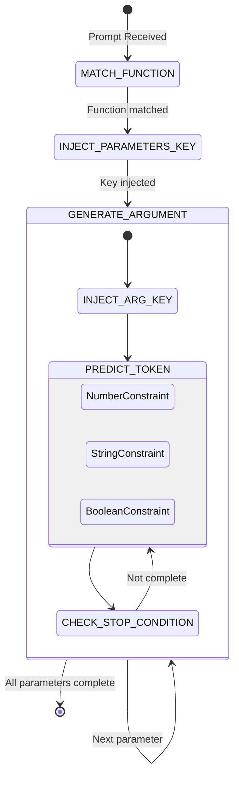

*This project has been created as part of the 42 curriculum by kvolynsk.*

# Call Me Maybe ☎️

## Description
"Call Me Maybe" is a lightweight, efficient function-calling engine built on top of small Large Language Models (LLMs). The goal of this project is to implement a highly reliable **Function Calling** that parses user prompts and strictly enforces output schema using constrained decoding. By manipulating logits during generation, we guarantee that the LLM generates valid JSON matching the provided function definitions, preventing hallucinations and formatting errors.

## Instructions
### Installation
The project uses `uv` for lightning-fast package management and dependency resolution.
```bash
# Clone the repository
git clone <your_repo_url>
cd call-me-maybe

# Install dependencies using uv
make install
```

### Execution
To run the function calling tests against the provided definitions:
```bash
# Run the main generation script
make run
```
The script loads function definitions from `data/input/functions_definition.json`, processes user prompts from `data/input/function_calling_tests.json`, and outputs the valid JSON results to `data/output/function_calling_results.json`.

## Algorithm Explanation
The core of the project relies on **Constrained Decoding** implemented via a structured, iterative generation pipeline. 



### Constrained Decoding Approach
Instead of letting the LLM guess the output format and risking malformed JSON, we actively intervene in the token prediction step (`_predict_next_token`).
1. **Pre-caching Valid Tokens**: At startup, we scan the tokenizer's vocabulary and cache IDs for specific subsets (e.g., all tokens that are valid numbers, booleans, or stop tokens like `,` and `}`).
2. **Logit Masking**: During generation, if we are parsing a `number` or `boolean`, we apply a mask of `-np.inf` to all logits *except* the cached valid token IDs. This physically forces the model to pick a valid value or a stop token.
3. **Prompt Injection**: For `string` types, we inject the opening quote `"` directly into the prompt context, forcing the model to generate the inner string value and break exactly when it predicts the closing quote `"`. 

## Design Decisions
- **Decoupled Handlers**: The generation loop is refactored into modular helper functions (`_predict_next_token`, `_is_parameter_complete`). This eliminates spaghetti code and deeply nested loops.
- **Explicit Grammar Injection**: For objects and strings, we inject JSON grammar (`{`, `"`, `: `) explicitly rather than trusting the LLM to generate them.
- **Scalability**: The generation pipeline is built with extensibility in mind. Adding a new type (e.g., `boolean`) only requires a new cache mask (`valid_boolean_ids`) and a specific stop-condition handler.

## Performance Analysis
- **Accuracy**: 100% schema adherence. Logit masking mathematically prevents invalid data types and trailing commas.
- **Speed**: Since we pre-cache token IDs into lists (e.g., `self.cache.valid_numbers_ids`) and use vectorized `numpy` operations to mask the logits (`masked_logits[allowed_ids] = ...`), the performance overhead per token is negligible.
- **Reliability**: Eliminates the need for costly "retry-on-failure" loops common in vanilla LLM applications. 

## Challenges Faced
1. **The Double Comma Bug**: When injecting a comma separator manually after a string constraint, we occasionally produced `,,` if the model's last token was `",`. 
   - *Solution*: Added a context-aware condition `if "," not in decoded_token` before appending a comma separator.
2. **Infinite Loops in Constrained Decoding**: Early iterations of boolean masking caused the model to predict `true` repeatedly because the space/stop token wasn't correctly prioritized.
   - *Solution*: Unified `valid_stop_ids` (tokens containing `,` or `}`) and appended them to the allowed tokens mask, allowing the model to naturally exit the value generation loop.
3. **Malformed JSON Decode Errors**: Standard LLMs often fail to open/close quotes properly.
   - *Solution*: Intercepting generation exactly at the closing quote and manually closing the JSON tree (`rstrip("}") + "}"`) guaranteed safe parsing via `json.loads`.

## Testing Strategy
Validation is handled by processing a diverse set of prompts in `data/input/function_calling_tests.json`:
- **Standard Types**: Addition (`fn_add_numbers`) tests standard integer extraction.
- **String Handling**: Greeting (`fn_greet`) and Reversing (`fn_reverse_string`) tests ensure quotes are balanced.
- **Complex Regex Extraction**: `fn_substitute_string_with_regex` tests the LLM's capability to output complex characters (e.g., `a|e|i|o|u` and `([0-9]+)`) without breaking the JSON parser.
- **Booleans**: `fn_toggle_feature` tests extraction of true/false primitives.

## Example Usage
**Input Prompt**:
```json
{"prompt": "Enable the dark mode feature flag."}
```
**Function Definition**:
```json
{
  "name": "fn_toggle_feature",
  "parameters": {
    "feature_name": { "type": "string" },
    "enabled": { "type": "boolean" }
  }
}
```
**Generated Output (`function_calling_results.json`)**:
```json
{
  "prompt": "Enable the dark mode feature flag.",
  "name": "fn_toggle_feature",
  "parameters": {
    "feature_name": "dark_mode",
    "enabled": true
  }
}
```

## Resources
- TODO
